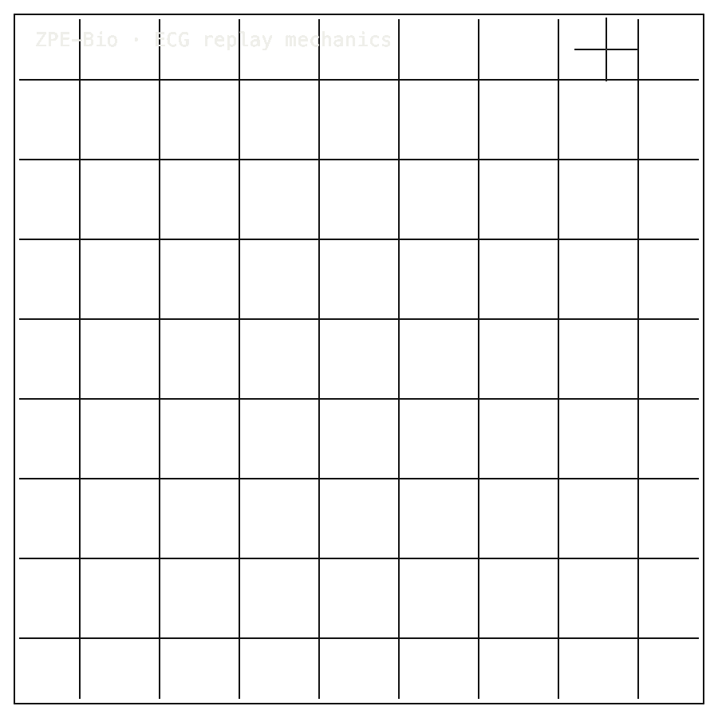

# ZPE-Bio

## Install / Developer Commands

#### Quick Start

```bash
python -m venv .venv
source .venv/bin/activate
pip install -e ".[dev,validation]"
python -m zpe_bio roundtrip --mode clinical --samples 250
```

Further reading:

- [`validation/results/README.md`](validation/results/README.md)
- [`validation/results/BENCHMARK_SUMMARY.md`](validation/results/BENCHMARK_SUMMARY.md)
- [`docs/ARCHITECTURE.md`](docs/ARCHITECTURE.md)
- [`docs/LEGAL_BOUNDARIES.md`](docs/LEGAL_BOUNDARIES.md)

---

<table width="100%">
<tr>
<td width="100%" valign="top">
<div><span><b>00 · ZPE-BIO</b> · ECG CODEC</span> <span>DEVELOPER-READY · PTB-XL OPEN</span></div>
      <h1>ECG that names its <span>excursion delta.</span></h1>
      <p>ECG-only staged codec · ZPE-Bio · PyPI <em>zpe-bio</em> v0.2.1 · github.com/Zer0pa/ZPE-Bio</p>
      <p>ZPE-Bio compresses heart-rhythm recordings and publishes the replay error on every dataset it touches. On MIT-BIH, all 48 records return inside the 2.32% clinical target with a <strong>mean replay error of 1.12%</strong>. PTB-XL processes cleanly but one record drifts to 5.29%, so the wider ECG surface is named, not claimed. This is a developer-ready archival codec, not a clinical device, wearable, or regulatory product.</p>
</td>
</tr>
</table>

<table width="100%">
<tr>
<td width="100%" valign="top">
<figure>
        <div></div>
        <figcaption><b>Scope:</b> ECG archive replay. MIT-BIH inside target; PTB-XL edge open. Not a clinical, wearable, or regulatory device.</figcaption>
      </figure>
</td>
</tr>
</table>

<table width="100%">
<tr>
<td width="100%" valign="top">
<div><b>01 · THE GAP</b> <span>MEASURED, NOT ASSUMED</span></div>
      <h2>ECG codecs that report file size without naming their replay error leave clinicians guessing.</h2>
</td>
</tr>
</table>

<table width="100%">
<tr>
<td width="100%" valign="top">
<div><b>02 · MARKETS</b> <span>ADJACENT FORECASTS</span></div>
      <div>
        <div>
          <div><span>Digital cardiovascular health &rsquo;30</span>  <span>$141.0B</span></div>
          <div><span>Cardiac monitoring devices &rsquo;32</span>  <span>$31.6B</span></div>
          <div><span>Wearable ECG monitors &rsquo;30</span>  <span>$13.7B</span></div>
          <div><span>ECG monitoring devices &rsquo;30</span>  <span>$12.4B</span></div>
          <div><span>ECG data analytics &rsquo;30</span>  <span>$4.2B</span></div>
        </div>
      </div>
      <div>Where this codec belongs: archive replay and cardiology data stewardship. <strong>No clinical-device, wearable, or regulatory readiness claim.</strong></div>
</td>
</tr>
</table>

<table width="100%">
<tr>
<td width="50%" valign="top">
<div><b>03 · VALUE</b></div>
      <div><span>48</span> <span>/48</span></div>
      <div>MIT-BIH records replay inside the 2.32% target &middot; <b>mean 1.12% replay error</b></div>
</td>
<td width="50%" valign="top">
<div><b>04 · INSIGHT</b></div>
      <h2>Every replayed ECG should carry <span>its measured change.</span></h2>
</td>
</tr>
</table>

<table width="100%">
<tr>
<td width="50%" valign="top">
<div><b>05.1 · CURRENT TECH</b> <span>SIZE WITHOUT FIDELITY</span></div>
        <p>Lossless compressors preserve bytes and report file-size ratios. They tell a cardiology archive nothing about how closely a replayed waveform tracks the original signal on any named clinical corpus.</p>
</td>
<td width="50%" valign="top">
<div><b>05.2 · OUR TECH</b> <span>REPLAY ERROR PUBLISHED</span></div>
        <p>ZPE-Bio reports replay error directly per dataset. On MIT-BIH, 48 of 48 records return at <strong>mean 1.12%</strong>, inside the <em>2.32% clinical target</em> a cardiology archive can show its review board. PTB-XL processes 100 of 100 records with full integrity but a worst-case record reaches 5.29%, so that corpus is named openly as out of contract rather than buried.</p>
</td>
</tr>
</table>

<table width="100%">
<tr>
<td width="100%" valign="top">
<div><b>05.3 · BENCHMARKS</b> <span>FOUR CORPORA</span></div>
      <div>
        <div>
          <div><span>MIT-BIH</span><b>48/48</b><small>PASS</small></div>
          <div><span>NSTDB</span><b>15/15</b><small>PASS</small></div>
          <div><span>EDB</span><b>90/90</b><small>PASS</small></div>
          <div><span>PRD target</span><b>2.32%</b><small>MIT-BIH</small></div>
        </div>
        <div>
          <div><span>MIT-BIH</span>  <span>PASS</span></div>
          <div><span>NSTDB</span>  <span>PASS</span></div>
          <div><span>PTB-XL</span>  <span>out</span></div>
        </div>
      </div>
      <div><b>Reported today:</b> MIT-BIH 48/48 &middot; NSTDB 15/15 &middot; EDB 90/90 &middot; PTB-XL 5.29% out.</div>
</td>
</tr>
</table>

<table width="100%">
<tr>
<td width="34%" valign="top">
<div><b>06 · MEASUREMENT</b> <span>PRD BY CORPUS</span></div>
      <h2>Replay error reported per corpus, <span>with MIT-BIH as the reference.</span></h2>
</td>
<td width="66%" valign="top">
<div><b>06.1 · COMPARATIVE PERFORMANCE</b> <span>PRD BY CORPUS</span></div>
      <div>
        <div>
          <div><span>MIT-BIH · mean</span>  <span>1.12%</span></div>
          <div><span>NSTDB · max</span>  <span>1.96%</span></div>
          <div><span>EDB · max</span>  <span>4.34% · LOG</span></div>
          <div><span>PTB-XL · max</span>  <span>5.29% · OUT</span></div>
        </div>
      </div>
      <div>MIT-BIH Arrhythmia (48 records), NSTDB (15), EDB (90), PTB-XL (100 sampled). MIT-BIH target: <b>replay error &le; 2.32%</b>. File-size winners stay gzip and zstd; this codec competes on fidelity, not bytes.</div>
</td>
</tr>
</table>

<table width="100%">
<tr>
<td width="100%" valign="top">
<div><b>07 · KEY METRICS</b> <span>MEASURED RESULTS</span></div>
</td>
</tr>
</table>

<table width="100%">
<tr>
<td width="100%" valign="top">
<div><b>07.1 · MIT-BIH INTEGRITY</b></div>
      <div>48<span>/48</span></div>
      <div>MIT-BIH records replay clean &middot; <b>integrity pass</b></div>
</td>
</tr>
</table>

<table width="100%">
<tr>
<td width="100%" valign="top">
<div><b>07.2 · MEAN CR</b></div>
      <div>1.12<span>%</span></div>
      <div>MIT-BIH aggregate replay error · <b>inside the clinical target</b></div>
</td>
</tr>
</table>

<table width="100%">
<tr>
<td width="100%" valign="top">
<div><b>07.3 · PTB-XL INTEGRITY</b></div>
      <div>100<span>/100</span></div>
      <div>PTB-XL 100-record sample · <b>worst 5.29% disclosed</b></div>
</td>
</tr>
</table>

<table width="100%">
<tr>
<td width="100%" valign="top">
<div><b>07.4 · PRD TARGET</b></div>
      <div>2.32<span>%</span></div>
      <div>MIT-BIH clinical target · <b>met by mean</b></div>
</td>
</tr>
</table>

<table width="100%">
<tr>
<td width="100%" valign="top">
<div><b>07.5 · MEAN PRD</b></div>
      <div>1.12<span>%</span></div>
      <div>MIT-BIH 48-record mean · <b>inside target</b></div>
</td>
</tr>
</table>

<table width="100%">
<tr>
<td width="100%" valign="top">
<div><b>08 · DETERMINISM</b> <span>CI PARITY PYTHON + RUST</span></div>
      <h2>Python and Rust replay the ECG surface <span>consistently.</span></h2>
</td>
</tr>
</table>

<table width="100%">
<tr>
<td width="66%" valign="top">
<div><b>08.1 · WHAT DETERMINISTIC MEANS</b> <span>ECG SURFACE ONLY</span></div>
      <p>Repo CI runs Python and Rust round-trips on every push across MIT-BIH, NSTDB, the European ST-T Database, and PTB-XL. Replay error is reported per dataset. MIT-BIH sits inside the 2.32% target at a mean of 1.12%.</p>
      <p>PTB-XL logs 100 of 100 records with full integrity, but the worst-case replay error reaches 5.29% and stays visible in the public results. PyPI 0.2.1 is stale and is not presented as fresh; the surface is ECG-only.</p>
</td>
<td width="34%" valign="top">
<div><b>08.2 · THE FIDELITY GAP</b></div>
      <span>Honest Blocker ·</span>
      <p>PTB-XL processes 100 of 100 records, but the worst-case replay error reaches <strong>5.29%</strong>, outside the <strong>2.32% MIT-BIH target</strong>. PyPI is stale at <em>zpe-bio 0.2.1</em>. Wearable-data scope and the <em>0x0400</em> marker policy are open. No clinical, regulatory, EEG, wearable, or raw-size superiority claim.</p>
</td>
</tr>
</table>

<table width="100%">
<tr>
<td width="33%" valign="top">
<div><b>09</b> </div>
      <h2>FIVE PATHS FROM ONE <span>CLINICAL CONTRACT.</span></h2>
</td>
<td width="67%" valign="top">
<div><b>09.1 · THE AMBITION</b></div>
      <p>The hinge is the disclosed boundary, not the passed contract. A codec that names its worst-case excursion alongside its pass rate becomes the substrate cardiology archives can adopt before regulatory engagement &mdash; because the open question is already on the table, not waiting in the field.</p>
</td>
</tr>
</table>

<table width="100%">
<tr>
<td width="33%" valign="top">
<div><b>09.2 · WHAT WORKS NOW</b> <span>EXTERNAL</span></div>
        <h2>MIT-BIH 48/48 records pass; the mean replay error of 1.12% sits inside the 2.32% clinical target.</h2>
</td>
<td width="67%" valign="top">
<div><b>09.3 · WHAT'S STILL OPEN</b> <span>EXTERNAL</span></div>
        <h2>PTB-XL excursion at 5.29%, stale PyPI release, wearable scope, and marker-policy decision are open.</h2>
</td>
</tr>
</table>

<table width="100%">
<tr>
<td width="100%" valign="top">
<div><b>09.4</b> &middot; ARCHIVES · NEAR-TERM (12–24 MO)</div>
      <div>Cardiology archives gain a fidelity floor</div><div>An academic cardiology lab can stop hoarding raw float32 MIT-BIH waveforms because every record returns inside a documented 2.32% replay error. Storage budgets fall and the archived signal still satisfies clinical research review.</div>
</td>
</tr>
</table>

<table width="100%">
<tr>
<td width="100%" valign="top">
<div><b>09.5</b> &middot; PROCUREMENT · NEAR-TERM (12–24 MO)</div>
      <div>Buyers decide before deployment, not after</div><div>A cardiology archive buyer who sees the PTB-XL 5.29% excursion published alongside the MIT-BIH pass rate can choose with eyes open. Disclosure shifts procurement from a post-purchase surprise to a pre-purchase conversation about which corpora the buyer actually needs.</div>
</td>
</tr>
</table>

<table width="100%">
<tr>
<td width="100%" valign="top">
<div><b>09.6</b> &middot; CLINICAL RESEARCH · MID-TERM (24–48 MO)</div>
      <div>Reproducible studies travel between sites</div><div>When two cardiology research groups share compressed waveforms with identical replay error, a finding produced at one institution can be re-run at another without arguing about whether the data was altered in transit. Reproducibility stops depending on raw-byte custody.</div>
</td>
</tr>
</table>

<table width="100%">
<tr>
<td width="100%" valign="top">
<div><b>09.7</b> &middot; BOUNDARY CLOSURE · MID-TERM (24–48 MO)</div>
      <div>PTB-XL becomes a routine corpus</div><div>If codec tuning brings the PTB-XL worst-case replay error from 5.29% under the 2.32% target, the PTB-XL population &mdash; broader demographics, more leads, longer recordings &mdash; joins the safely archivable set. The cardiology research community gains a second large public corpus with a fidelity guarantee.</div>
</td>
</tr>
</table>

<table width="100%">
<tr>
<td width="100%" valign="top">
<div><b>09.8</b> &middot; INDUSTRY STANDARD · PARADIGM (48 MO+)</div>
      <div>Fidelity claims arrive with disclosure attached</div><div>ECG codecs across the industry begin publishing their per-dataset thresholds, worst-case excursions, and pass rates as standard practice. Hospitals, regulators, and procurement teams stop accepting a single global fidelity number and start asking which corpus, which boundary, which pass rate.</div>
</td>
</tr>
</table>
